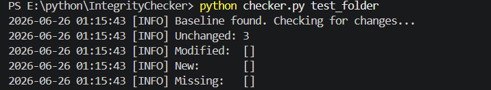
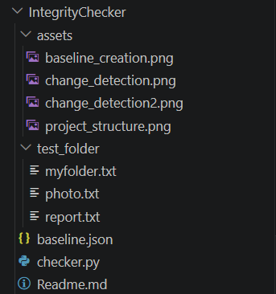

# File Integrity Checker

A small Python tool that watches a folder for changes. It works by hashing every file with SHA-256 and saving those hashes to a JSON file. The next time you run it, it re-hashes everything and tells you exactly what changed, what got deleted, and what's new.

I built this mainly to practice working with JSON in Python (reading and writing it to disk), plus some basic error handling, logging, and argparse along the way.

## How it works

The first time you run the script on a folder, there's nothing to compare against yet, so it just creates a baseline file (`baseline.json`) with the hash of every file it finds.

Every time after that, it loads the old baseline, scans the folder again, and compares the two. Files get sorted into four buckets:

- unchanged - hash is exactly the same as before
- modified - file still exists but its content changed
- new - file wasn't in the old baseline at all
- missing - file was in the old baseline but can't be found anymore

If you pass `--update`, it'll save the current scan as the new baseline after showing you the report, so the next run compares against today instead of the original snapshot.

## Usage

Run a first scan (this creates the baseline):

```
python3 integrity_checker.py /path/to/folder
```

Run it again later to check for changes:

```
python3 integrity_checker.py /path/to/folder
```

Check for changes AND update the baseline at the same time:

```
python3 integrity_checker.py /path/to/folder --update
```

Use a custom baseline file instead of the default `baseline.json`:

```
python3 integrity_checker.py /path/to/folder --baseline my_baseline.json
```

See all options:

```
python3 integrity_checker.py --help
```

## Example Output



## Change Detection


## Project Structure



Example run where:
- `notes.txt` was modified
- `myfolder` was added
- `notes.txt` was deleted

The tool compares the current folder state against the stored baseline and reports the differences.

## Why SHA-256

SHA-256 is a hashing algorithm, which basically means it turns any file's content into a fixed-length string of characters. Change even one byte in the file and the hash comes out completely different. It's not encryption and you can't reverse it back into the original file, it's just a fingerprint used to detect changes, which is exactly what this project needed.

## What's in baseline.json

It's a flat JSON object where each key is a file path (relative to the folder you scanned) and each value is that file's SHA-256 hash. Something like this:

```
{
    "file1.txt": "a948904f2f0f479b8f8197694b30184b0d2ed1c1cd2a1ec0fb85d299a192a447",
    "subfolder/file3.txt": "414f8e9fd34ff68f66cbdab5ec63a5e738aa107f3454fa7edb51f49528abf9c6"
}
```

Paths are stored relative to the scanned folder on purpose, so the baseline still works even if you move the folder somewhere else or run the script on a different machine.

## Known limitations

- If a baseline.json file gets manually edited and breaks (bad JSON syntax), the script will tell you it's corrupted and ask you to delete it. It won't try to repair it.
- Empty folders aren't tracked since there's nothing inside them to hash.
- Permission errors on individual files are skipped with a warning instead of stopping the whole scan.

## Possible next steps

- Add timestamps to each entry so you know when a file was last checked
- Email or notify when something changes instead of just printing it
- Option to ignore certain file types or folders (like __pycache__)

## Requirements

Just Python 3.10 or newer. No external packages needed, everything used here is from the standard library.
